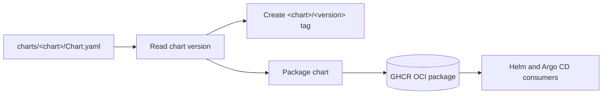

# Helm charts

Shared Helm charts published as public OCI packages for Kubernetes workloads.

## Overview

This repository contains reusable Helm charts. Each chart has an independent
version and is published as a public OCI package in GitHub Container Registry.

## Chart Catalogue

| Chart                                   | Latest version | OCI reference                           | Purpose                                                                                                                                                                                     |
| --------------------------------------- | -------------- | --------------------------------------- | ------------------------------------------------------------------------------------------------------------------------------------------------------------------------------------------- |
| [signalcli](charts/signalcli/README.md) | `1.0.0`        | `oci://ghcr.io/f2calv/charts/signalcli` | Deploys [signal-cli-rest-api](https://github.com/bbernhard/signal-cli-rest-api) with persistent account state, compatible probes, JVM-sized resources, and validated environment variables. |
| [workload](charts/workload/README.md)   | `1.0.3`        | `oci://ghcr.io/f2calv/charts/workload`  | Deploys common Kubernetes workload kinds through framework-neutral templates with concise defaults and opt-in operational controls.                                                         |

## Versioning

The `version` field in each chart's `Chart.yaml` is the source of truth for its
release. Chart versions advance independently, and Git tags use the
`<chart>/<version>` format, for example `workload/1.0.3`. OCI package versions
use the bare semantic version, for example `1.0.3`.

## Deployment Flow

