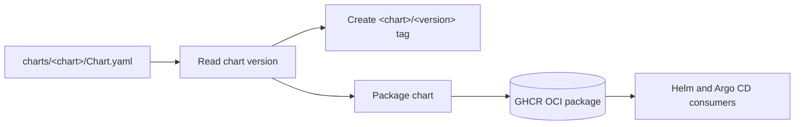

## Overview

This repository contains reusable Helm charts maintained by f2calv. Each chart
has an independent version and is published as a public OCI package in GitHub
Container Registry.

The `workload` package is a universal, framework-neutral chart for common
Kubernetes workload kinds. Sensible defaults keep routine deployments concise,
while opt-in values cover autoscaling, jobs, networking, storage, pod
scheduling, and disruption budgets. This avoids repeating a large,
application-specific chart for every container image.

## Chart Catalogue

| Chart      | OCI reference                                  | Purpose                                    |
|------------|------------------------------------------------|--------------------------------------------|
| `workload` | `oci://ghcr.io/f2calv/charts/workload`         | Universal chart for common workload kinds  |

## Helm Dependency

Reference the chart from an umbrella chart with its published version:

```yaml
dependencies:
  - name: workload
    version: 1.0.2
    repository: oci://ghcr.io/f2calv/charts
    alias: api
```

Resolve the dependency from the umbrella chart directory:

```bash
helm dependency update
```

## Argo CD Application

Argo CD can consume the same OCI package directly:

```yaml
apiVersion: argoproj.io/v1alpha1
kind: Application
metadata:
  name: example
  namespace: argocd
spec:
  project: default
  destination:
    namespace: example
    server: https://kubernetes.default.svc
  source:
    repoURL: ghcr.io/f2calv
    chart: charts/workload
    targetRevision: 1.0.2
    helm:
      valuesObject:
        kind: Deployment
        replicaCount: 1
        image:
          repository: ghcr.io/example/example
          tag: 1.0.2
          pullPolicy: IfNotPresent
  syncPolicy:
    automated:
      prune: true
      selfHeal: true
```

## Versioning

The `version` field in each chart's `Chart.yaml` is the source of truth for its
release. Chart versions advance independently, and Git tags use the
`<chart>/<version>` format, for example `workload/1.0.2`. OCI package versions
use the bare semantic version, for example `1.0.2`.

## Deployment Flow


